# Semana 2: Arduinos y circuitos

Durante esta semana trabajé con **Arduino UNO y circuitos electrónicos**, realizando diferentes prácticas para conocer las funciones básicas del microcontrolador, las conexiones de los componentes y la programación mediante Arduino IDE.

# Arduino, ¿qué es?

Arduino es una plataforma de hardware y software de código abierto que permite desarrollar proyectos electrónicos mediante la programación de una placa con un microcontrolador. En estas prácticas utilicé principalmente **Arduino UNO**, realizando circuitos sencillos y comprobando su funcionamiento por medio del código.

## ¿Cómo se utiliza Arduino IDE?

Primero se conecta la placa Arduino UNO a la computadora mediante un cable USB. Después se escribe el programa o *sketch* en Arduino IDE, se verifica que el código no tenga errores y finalmente se carga a la placa para comprobar el funcionamiento del circuito.

# Lista de materiales

## Arduino UNO

Placa con el microcontrolador que ejecuta los programas y controla los componentes del circuito.

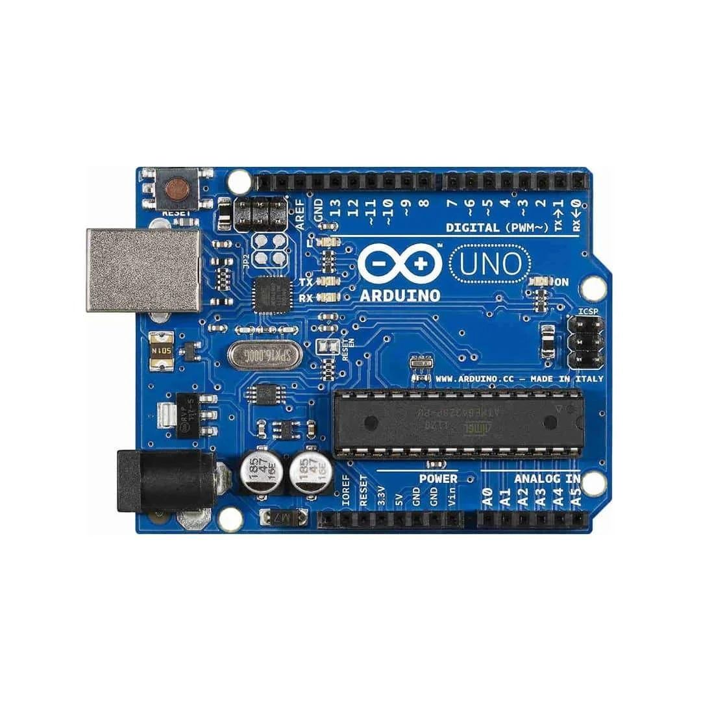

## Cable USB-A a USB-B

Se utiliza para conectar el Arduino UNO a la computadora, cargar los programas y proporcionar alimentación a la placa.

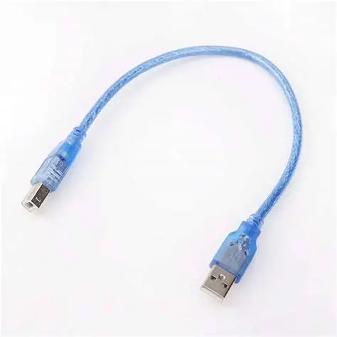

## Protoboard

Tablero de pruebas que permite realizar conexiones de circuitos electrónicos sin necesidad de soldar.

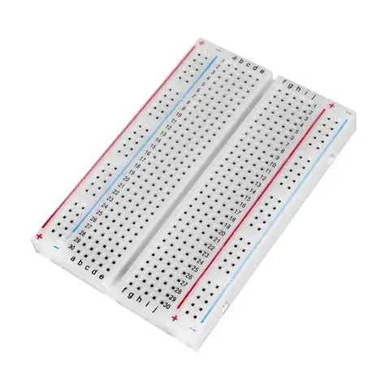

## Jumpers

Cables utilizados para realizar las conexiones entre el Arduino, la protoboard y los diferentes componentes.

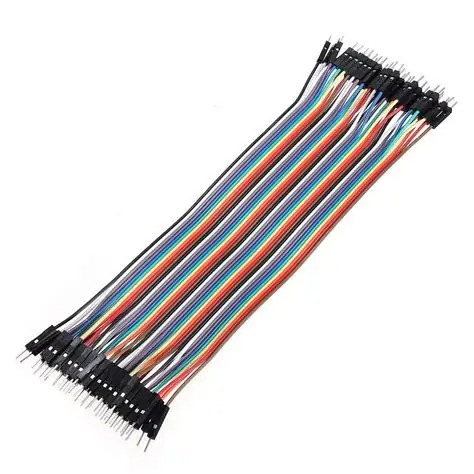

## LED

Diodo emisor de luz utilizado como indicador visual para comprobar las salidas digitales del Arduino.

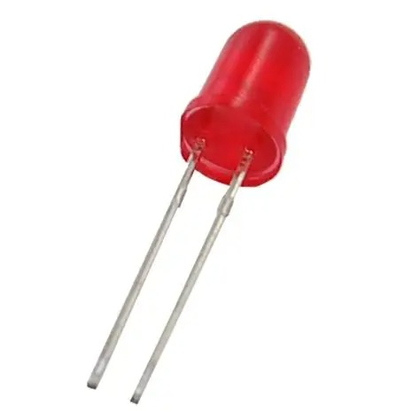

## Resistencias

Componentes utilizados para limitar la corriente y proteger los elementos electrónicos. Se utilizaron resistencias de **1 kΩ y 220 Ω**.

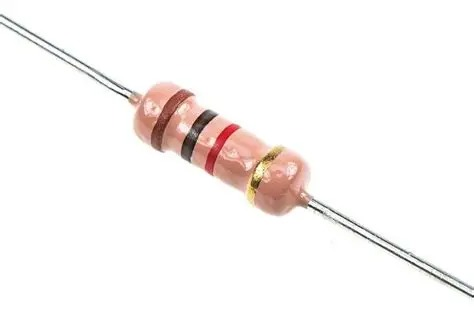 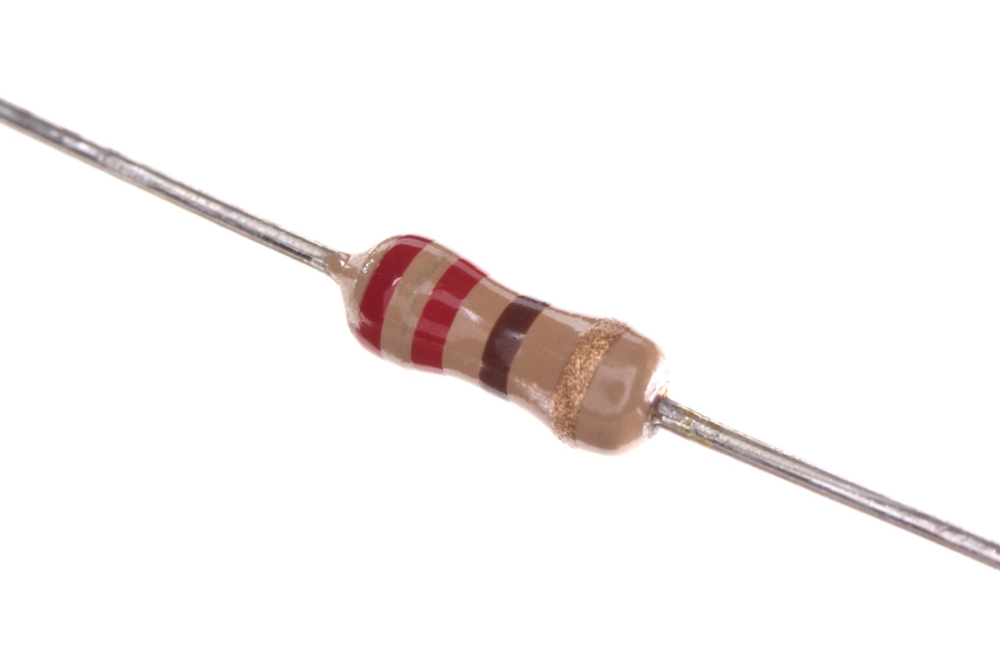

## Display de 7 segmentos

Dispositivo formado por varios segmentos LED que permite representar números y algunos caracteres.

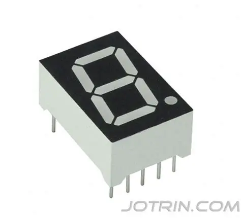

## Servomotor 9g

Motor que permite controlar la posición de su eje mediante señales enviadas desde el Arduino.

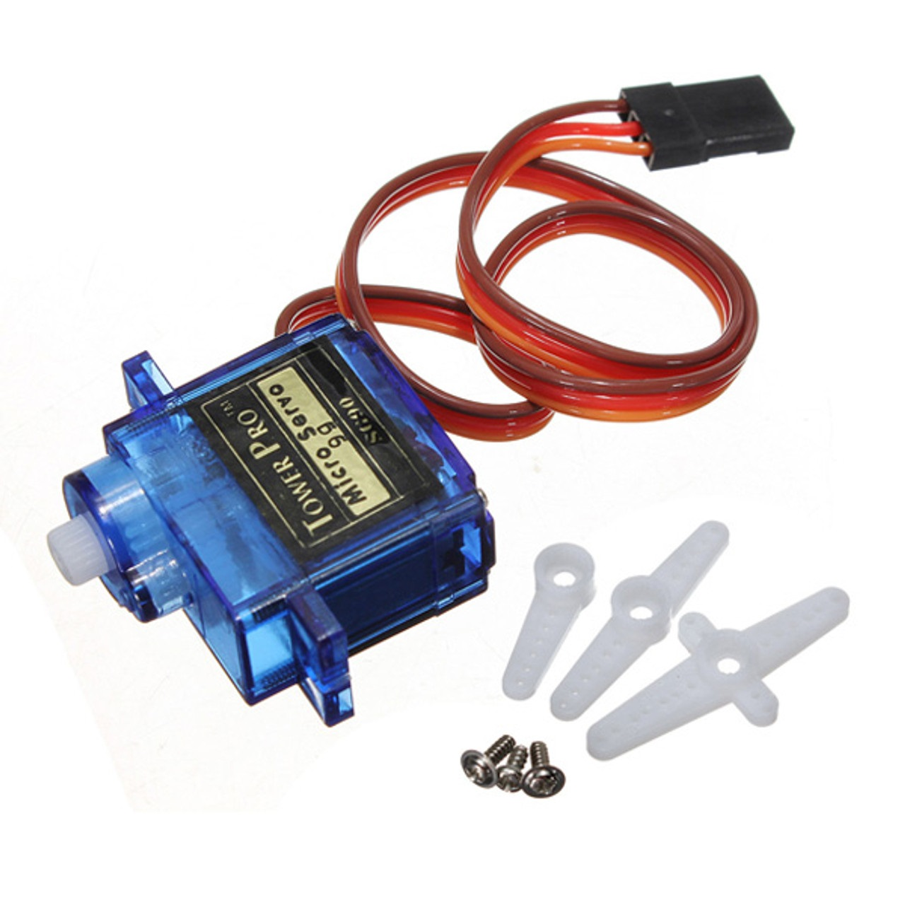

## Potenciómetro

Resistencia variable utilizada para modificar un valor de entrada y controlar diferentes comportamientos del circuito.

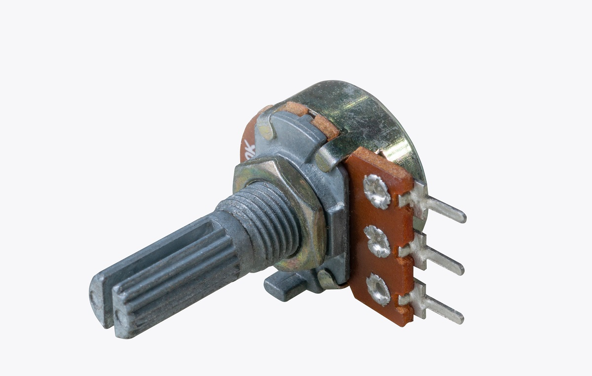

## Fuente de poder

Fuente utilizada para proporcionar alimentación eléctrica a los componentes cuando se requiere una alimentación externa.

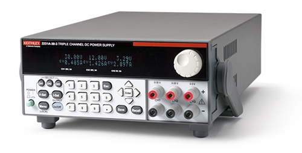

## Push button (NO)

Botón normalmente abierto utilizado como entrada digital para enviar una señal al Arduino al ser presionado.

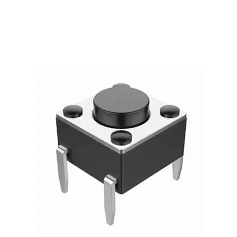

# Prácticas

Realicé **16 prácticas de Arduino**, documentadas mediante videos. Las evidencias están organizadas en la carpeta de Google Drive correspondiente.

## Evidencias de las prácticas

| Práctica | Evidencia |
|---|---|
| 01 — Arduino 1 | [▶️ Ver video](https://drive.google.com/drive/folders/1PZON3fq6U52o09Jvimv5RmKZLp7TAL8l?usp=sharing) |
| 02 — Arduino 2 | [▶️ Ver video](https://drive.google.com/drive/folders/1PZON3fq6U52o09Jvimv5RmKZLp7TAL8l?usp=sharing) |
| 03 — Arduino 3 | [▶️ Ver video](https://drive.google.com/drive/folders/1PZON3fq6U52o09Jvimv5RmKZLp7TAL8l?usp=sharing) |
| 04 — Arduino 4 | [▶️ Ver video](https://drive.google.com/drive/folders/1PZON3fq6U52o09Jvimv5RmKZLp7TAL8l?usp=sharing) |
| 05 — Arduino 5 | [▶️ Ver video](https://drive.google.com/drive/folders/1PZON3fq6U52o09Jvimv5RmKZLp7TAL8l?usp=sharing) |
| 06 — Arduino 6 | [▶️ Ver video](https://drive.google.com/drive/folders/1PZON3fq6U52o09Jvimv5RmKZLp7TAL8l?usp=sharing) |
| 07 — Arduino 7 | [▶️ Ver video](https://drive.google.com/drive/folders/1PZON3fq6U52o09Jvimv5RmKZLp7TAL8l?usp=sharing) |
| 08 — Arduino 8 | [▶️ Ver video](https://drive.google.com/drive/folders/1PZON3fq6U52o09Jvimv5RmKZLp7TAL8l?usp=sharing) |
| 09 — Arduino 9 | [▶️ Ver video](https://drive.google.com/drive/folders/1PZON3fq6U52o09Jvimv5RmKZLp7TAL8l?usp=sharing) |
| 10 — Arduino 10 | [▶️ Ver video](https://drive.google.com/drive/folders/1PZON3fq6U52o09Jvimv5RmKZLp7TAL8l?usp=sharing) |
| 11 — Arduino 11 | [▶️ Ver video](https://drive.google.com/drive/folders/1PZON3fq6U52o09Jvimv5RmKZLp7TAL8l?usp=sharing) |
| 12 — Arduino 12 | [▶️ Ver video](https://drive.google.com/drive/folders/1PZON3fq6U52o09Jvimv5RmKZLp7TAL8l?usp=sharing) |
| 13 — Arduino 13 | [▶️ Ver video](https://drive.google.com/drive/folders/1PZON3fq6U52o09Jvimv5RmKZLp7TAL8l?usp=sharing) |
| 14 — Arduino 14 | [▶️ Ver video](https://drive.google.com/drive/folders/1PZON3fq6U52o09Jvimv5RmKZLp7TAL8l?usp=sharing) |
| 15 — Arduino 15 | [▶️ Ver video](https://drive.google.com/drive/folders/1PZON3fq6U52o09Jvimv5RmKZLp7TAL8l?usp=sharing) |
| 16 — Arduino 16 | [▶️ Ver video](https://drive.google.com/drive/folders/1PZON3fq6U52o09Jvimv5RmKZLp7TAL8l?usp=sharing) |


## Imágenes y códigos de las prácticas

### Práctica 01 — Arduino 1

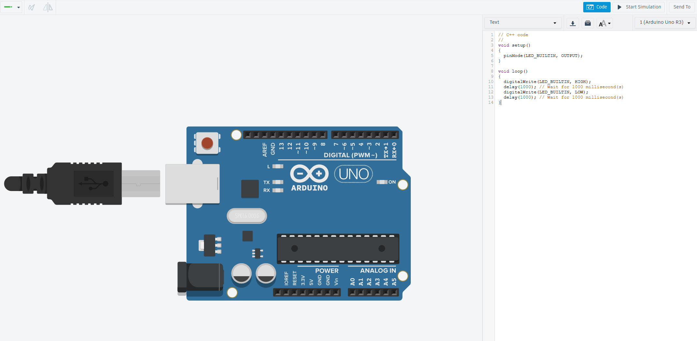

```cpp
// C++ code
//
void setup()
{
  pinMode(LED_BUILTIN, OUTPUT);
}

void loop()
{
  digitalWrite(LED_BUILTIN, HIGH);
  delay(1000); // Wait for 1000 millisecond(s)
  digitalWrite(LED_BUILTIN, LOW);
  delay(1000); // Wait for 1000 millisecond(s)
}
```

### Práctica 02 — Arduino 2

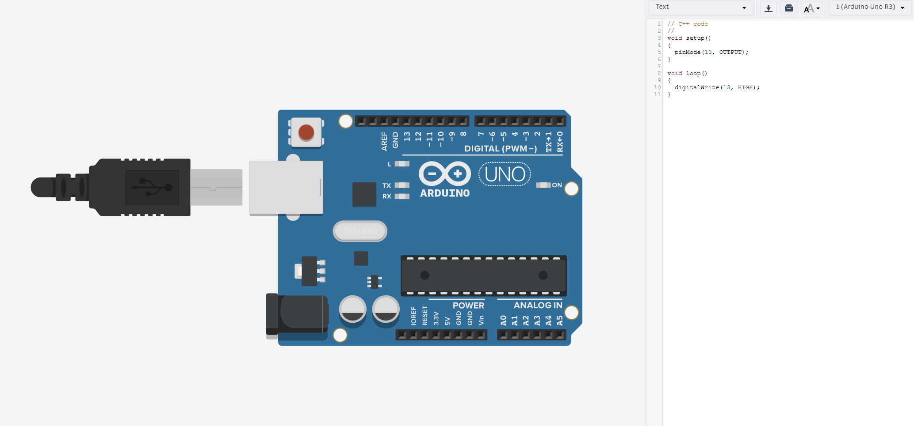

```cpp
// C++ code
//
void setup()
{
  pinMode(13, OUTPUT);
}

void loop()
{
  digitalWrite(13, HIGH);
}
```

### Práctica 03 — Arduino 3

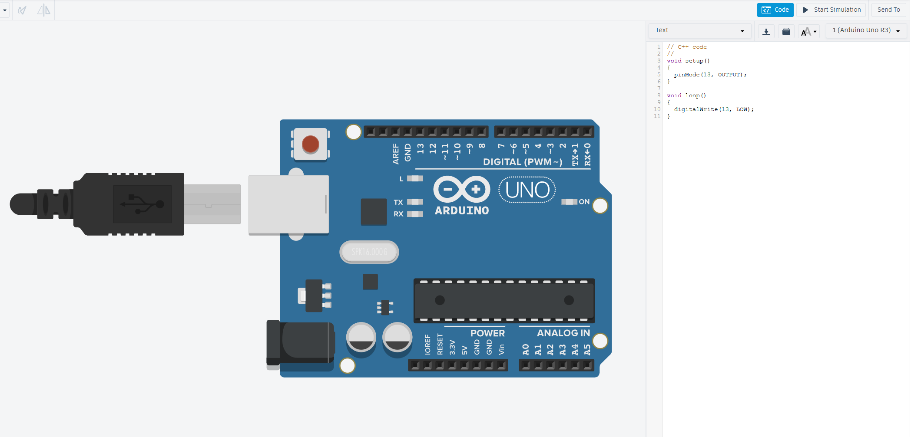

```cpp
// C++ code
//
void setup()
{
  pinMode(13, OUTPUT);
}

void loop()
{
  digitalWrite(13, LOW);
}
```

### Práctica 04 — Arduino 4

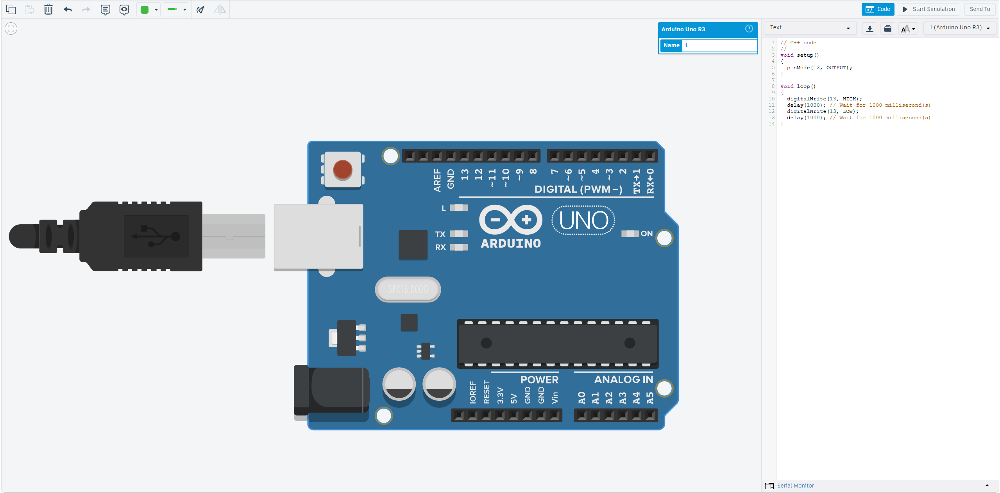

```cpp
// C++ code
//
void setup()
{
  pinMode(13, OUTPUT);
}

void loop()
{
  digitalWrite(13, HIGH);
  delay(1000); // Wait for 1000 millisecond(s)
  digitalWrite(13, LOW);
  delay(1000); // Wait for 1000 millisecond(s)
}
```

### Práctica 05 — Arduino 5

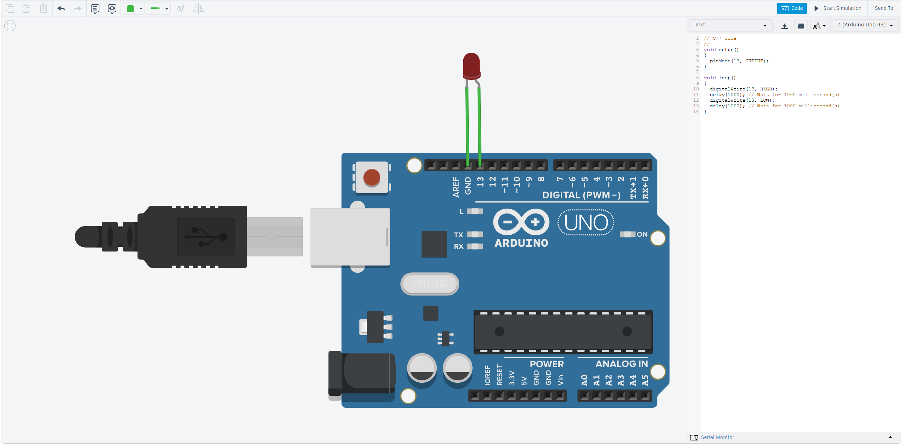

```cpp
// C++ code
//
void setup()
{
  pinMode(13, OUTPUT);
}

void loop()
{
  digitalWrite(13, HIGH);
  delay(1000); // Wait for 1000 millisecond(s)
  digitalWrite(13, LOW);
  delay(1000); // Wait for 1000 millisecond(s)
}
```

### Práctica 06 — Arduino 6

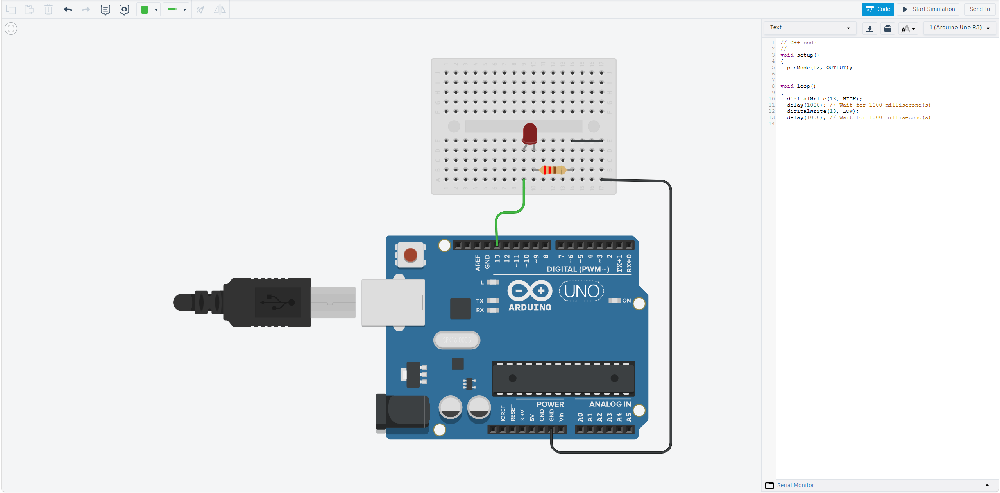

```cpp
// C++ code
//
void setup()
{
  pinMode(13, OUTPUT);
}

void loop()
{
  digitalWrite(13, HIGH);
  delay(1000); // Wait for 1000 millisecond(s)
  digitalWrite(13, LOW);
  delay(1000); // Wait for 1000 millisecond(s)
}
```

### Práctica 07 — Arduino 7


```cpp
// C++ code
//
void setup()
{
  pinMode(13, OUTPUT);
  pinMode(12, OUTPUT);
}

void loop()
{
  digitalWrite(13, HIGH);
  delay(1000); // Wait for 1000 millisecond(s)
  digitalWrite(13, LOW);
  delay(1000); // Wait for 1000 millisecond(s)
  digitalWrite(12, HIGH);
  delay(1000); // Wait for 1000 millisecond(s)
  digitalWrite(12, LOW);
  delay(1000); // Wait for 1000 millisecond(s)
}
```

### Práctica 08 — Arduino 8

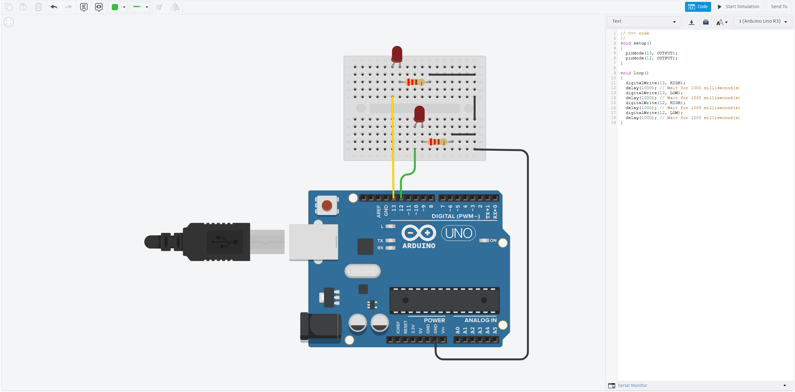

```cpp
// C++ code
//
void setup()
{
  pinMode(13, OUTPUT);
}

void loop()
{
  digitalWrite(13, HIGH);
  delay(1000); // Wait for 1000 millisecond(s)
  digitalWrite(13, LOW);
  delay(1000); // Wait for 1000 millisecond(s)
}
```

### Práctica 09 — Arduino 9

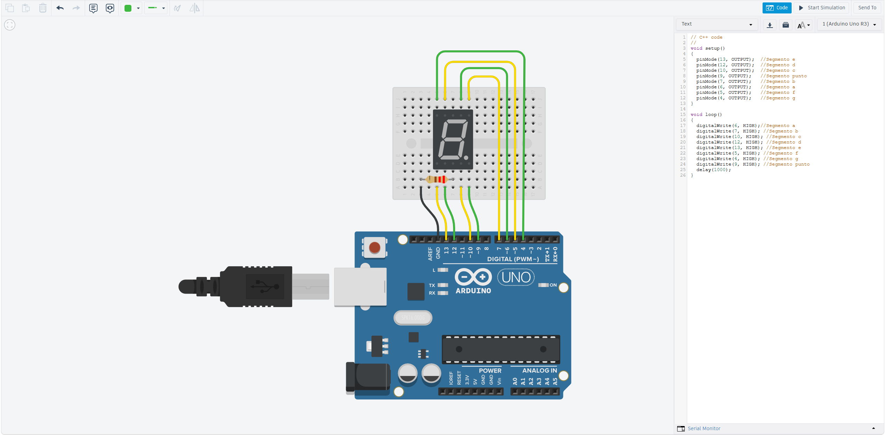

```cpp
// C++ code
//
void setup()
{
  pinMode(13, OUTPUT);	//Segmento e
  pinMode(12, OUTPUT);	//Segmento d
  pinMode(10, OUTPUT);	//Segmento c
  pinMode(9, OUTPUT);	//Segmento punto
  pinMode(7, OUTPUT);	//Segmento b
  pinMode(6, OUTPUT);	//Segmento a
  pinMode(5, OUTPUT);	//Segmento f
  pinMode(4, OUTPUT);	//Segmento g
}

void loop()
{
  digitalWrite(6, HIGH);//Segmento a
  digitalWrite(7, HIGH); //Segmento b
  digitalWrite(10, HIGH); //Segmento c
  digitalWrite(12, HIGH); //Segmento d
  digitalWrite(13, HIGH); //Segmento e
  digitalWrite(5, HIGH); //Segmento f
  digitalWrite(4, HIGH); //Segmento g
  digitalWrite(9, HIGH); //Segmento punto
  delay(1000);
}
```

### Práctica 10 — Arduino 10

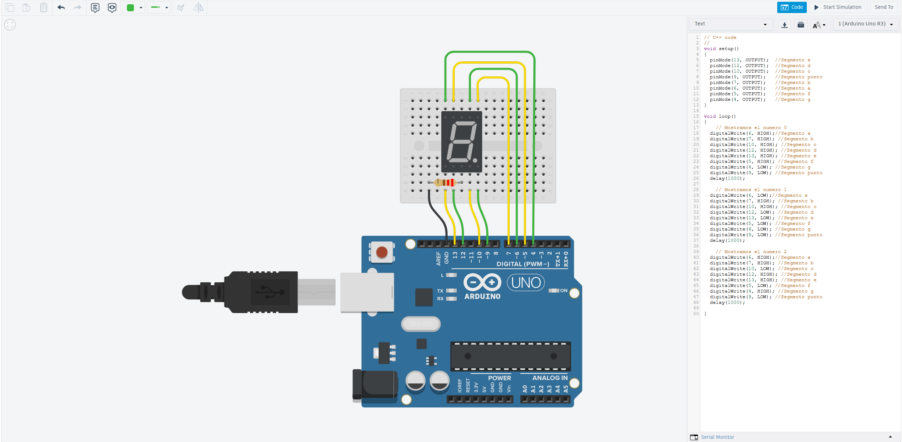

```cpp
// C++ code
//
void setup()
{
  pinMode(13, OUTPUT);	//Segmento e
  pinMode(12, OUTPUT);	//Segmento d
  pinMode(10, OUTPUT);	//Segmento c
  pinMode(9, OUTPUT);	//Segmento punto
  pinMode(7, OUTPUT);	//Segmento b
  pinMode(6, OUTPUT);	//Segmento a
  pinMode(5, OUTPUT);	//Segmento f
  pinMode(4, OUTPUT);	//Segmento g
}

void loop()
{
    // Mostramos el numero 0
  digitalWrite(6, HIGH);//Segmento a
  digitalWrite(7, HIGH); //Segmento b
  digitalWrite(10, HIGH); //Segmento c
  digitalWrite(12, HIGH); //Segmento d
  digitalWrite(13, HIGH); //Segmento e
  digitalWrite(5, HIGH); //Segmento f
  digitalWrite(4, LOW); //Segmento g
  digitalWrite(9, LOW); //Segmento punto
  delay(1000);
  
    // Mostramos el numero 1
  digitalWrite(6, LOW);//Segmento a
  digitalWrite(7, HIGH); //Segmento b
  digitalWrite(10, HIGH); //Segmento c
  digitalWrite(12, LOW); //Segmento d
  digitalWrite(13, LOW); //Segmento e
  digitalWrite(5, LOW); //Segmento f
  digitalWrite(4, LOW); //Segmento g
  digitalWrite(9, LOW); //Segmento punto
  delay(1000);
  
    // Mostramos el numero 2
  digitalWrite(6, HIGH);//Segmento a
  digitalWrite(7, HIGH); //Segmento b
  digitalWrite(10, LOW); //Segmento c
  digitalWrite(12, HIGH); //Segmento d
  digitalWrite(13, HIGH); //Segmento e
  digitalWrite(5, LOW); //Segmento f
  digitalWrite(4, HIGH); //Segmento g
  digitalWrite(9, LOW); //Segmento punto
  delay(1000);
  
}
```

### Práctica 11 — Arduino 11

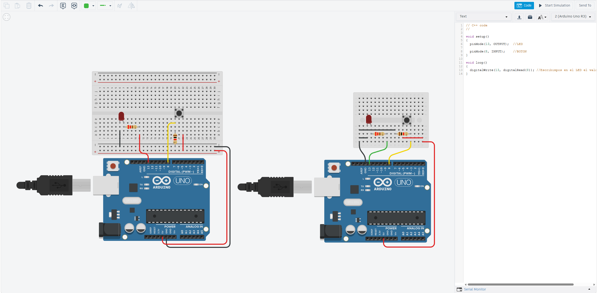

```cpp
// C++ code
//

void setup()
{
  pinMode(13, OUTPUT);	//LED
  
  pinMode(8, INPUT);	//BOTON
}

void loop()
{
  digitalWrite(13, digitalRead(8)); //Escribimpos en el LED el valor del BOTON
}
```

### Práctica 12 — Arduino 12

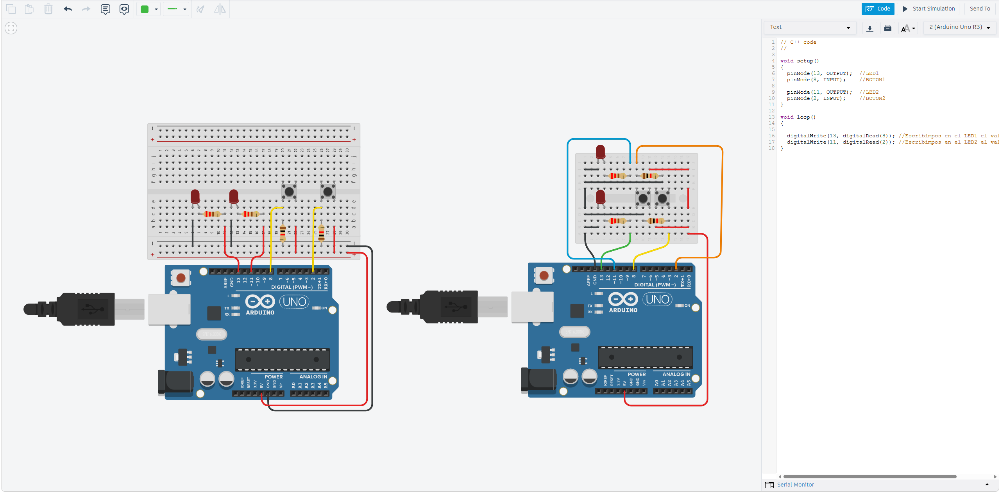

```cpp
// C++ code
//

void setup()
{
  pinMode(13, OUTPUT);	//LED1
  pinMode(8, INPUT);	//BOTON1
  
  pinMode(11, OUTPUT);	//LED2
  pinMode(2, INPUT);	//BOTON2
}

void loop()
{
  
  digitalWrite(13, digitalRead(8)); //Escribimpos en el LED1 el valor del BOTON1
  digitalWrite(11, digitalRead(2)); //Escribimpos en el LED2 el valor del BOTON2
}
```

### Práctica 13 — Arduino 13

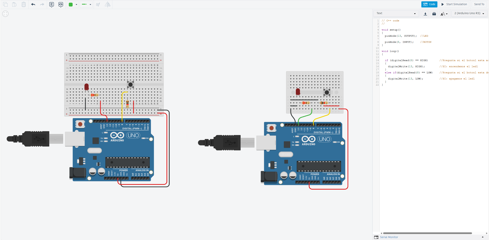

```cpp
// C++ code
//

void setup()
{
  pinMode(13, OUTPUT);	//LED
  
  pinMode(8, INPUT);	//BOTON
}

void loop()
{
  
  if (digitalRead(8) == HIGH)		//Pregunta si el boton1 esta activado
  {
    digitalWrite(13, HIGH);			//SI: encendemos el led1
  }
  else if(digitalRead(8) == LOW)	//Pregunta si el boton1 esta desactivado
  {
    digitalWrite(13, LOW);			//SI: apagamos el led1
  }
}
```

### Práctica 14 — Arduino 14

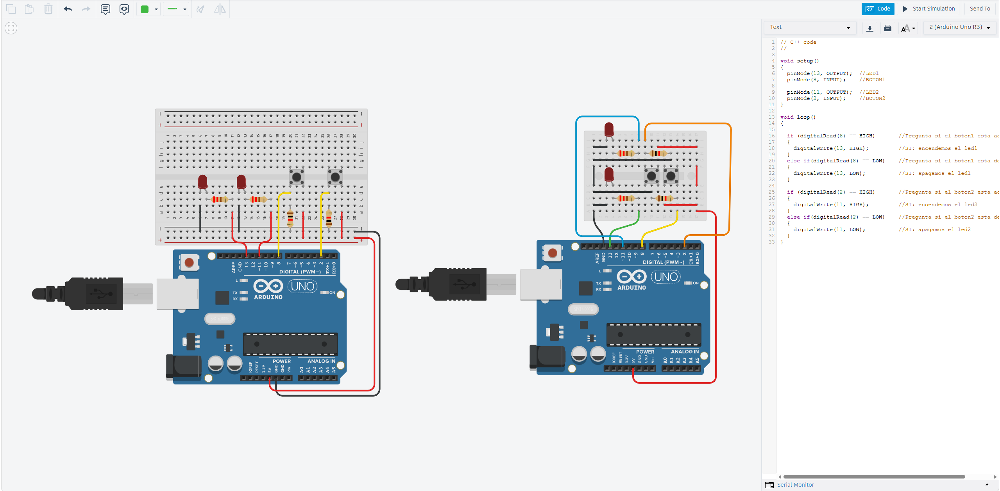

```cpp
// C++ code
//

void setup()
{
  pinMode(13, OUTPUT);	//LED1
  pinMode(8, INPUT);	//BOTON1
  
  pinMode(11, OUTPUT);	//LED2
  pinMode(2, INPUT);	//BOTON2
}

void loop()
{
  
  if (digitalRead(8) == HIGH)		//Pregunta si el boton1 esta activado
  {
    digitalWrite(13, HIGH);			//SI: encendemos el led1
  }
  else if(digitalRead(8) == LOW)	//Pregunta si el boton1 esta desactivado
  {
    digitalWrite(13, LOW);			//SI: apagamos el led1
  }
  
  if (digitalRead(2) == HIGH)		//Pregunta si el boton2 esta activado
  {
    digitalWrite(11, HIGH);			//SI: encendemos el led2
  }
  else if(digitalRead(2) == LOW)	//Pregunta si el boton2 esta desactivado
  {
    digitalWrite(11, LOW);			//SI: apagamos el led2
  }
}
```

### Práctica 15 — Arduino 15

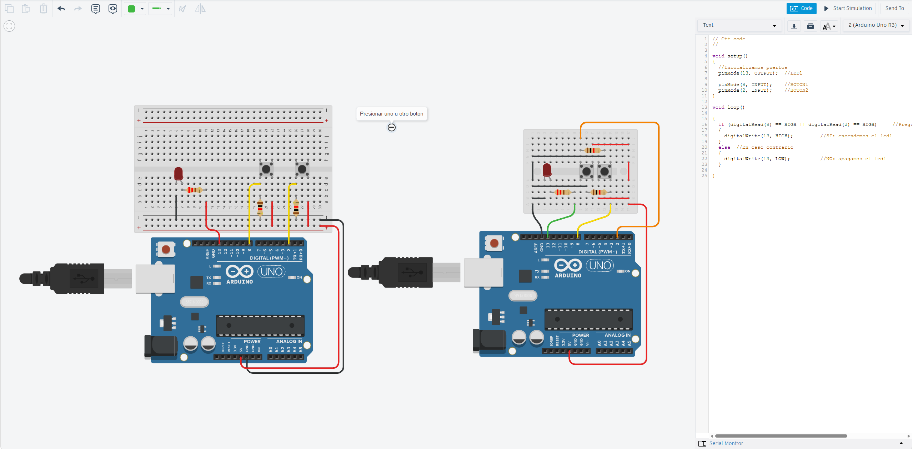

```cpp
// C++ code
//

void setup()
{
  //Inicializamos puertos
  pinMode(13, OUTPUT);	//LED1
  
  pinMode(8, INPUT);	//BOTON1
  pinMode(2, INPUT);	//BOTON2
}

void loop()
  
{
  if (digitalRead(8) == HIGH || digitalRead(2) == HIGH)		//Pregunta si se cumple la condición
  {
    digitalWrite(13, HIGH);			//SI: encendemos el led1
  }
  else	//En caso contrario
  {
    digitalWrite(13, LOW);			//NO: apagamos el led1
  }

}
```

### Práctica 16 — Arduino 16


```cpp
// C++ code
//

void setup()
{
  //Inicializamos puertos
  pinMode(13, OUTPUT);	//LED1
  
  pinMode(8, INPUT);	//BOTON1
  pinMode(2, INPUT);	//BOTON2
}

void loop()
{
  
  if (digitalRead(8) == HIGH && digitalRead(2) == HIGH)		//Pregunta si se cumple la condición
  {
    digitalWrite(13, HIGH);			//SI: encendemos el led1
  }
  else	//En caso contrario
  {
    digitalWrite(13, LOW);			//NO: apagamos el led1
  }

}
```

## Carpeta de evidencias

[🎬 Abrir carpeta de videos de Arduino](https://drive.google.com/drive/folders/1PZON3fq6U52o09Jvimv5RmKZLp7TAL8l?usp=sharing)

# Conclusión

Estas prácticas me permitieron conocer mejor el funcionamiento del **Arduino UNO**, sus entradas y salidas, y la manera en que el código interactúa con los componentes electrónicos. También reforcé mis conocimientos de programación y electrónica mediante la construcción y comprobación de circuitos, temas relacionados directamente con **Mecatrónica y Sistemas Ciberfísicos**.
