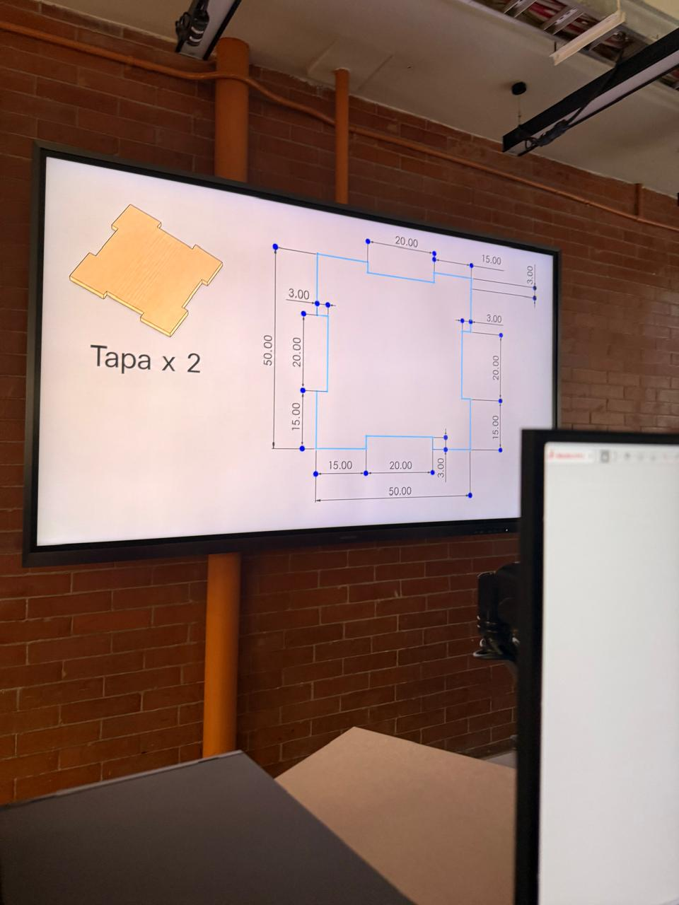
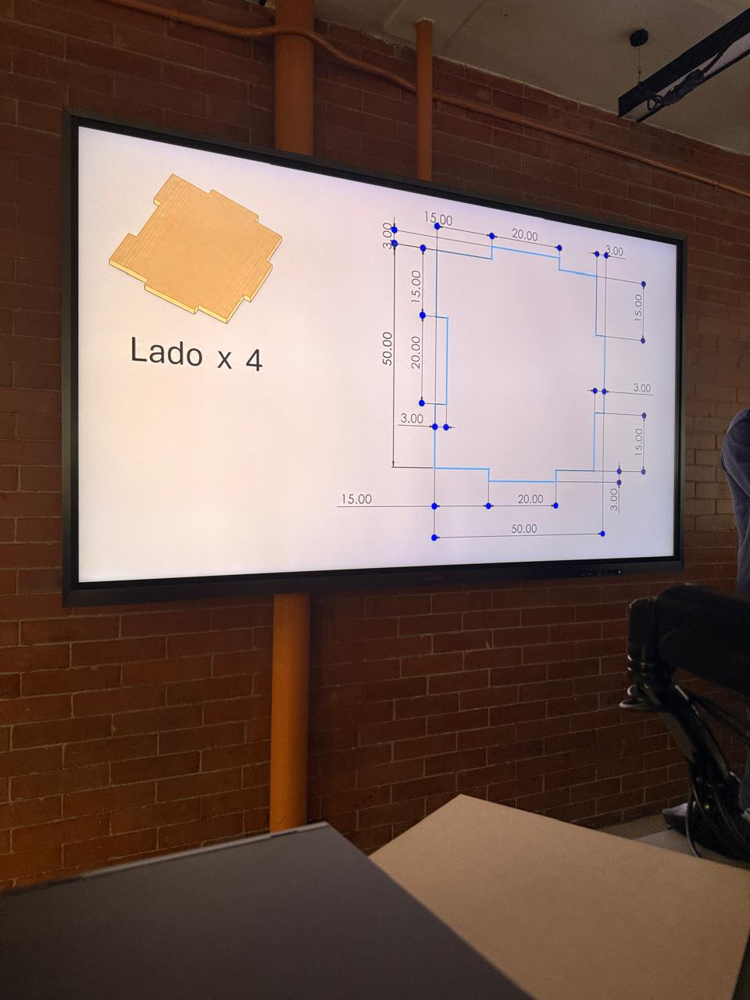
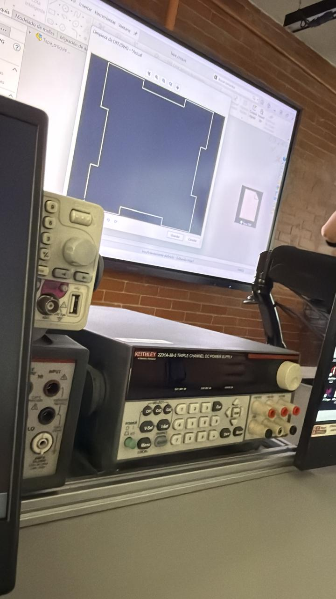
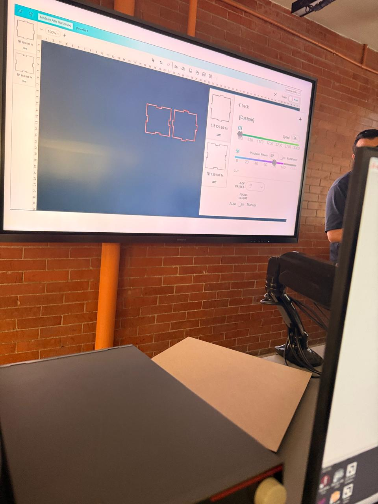
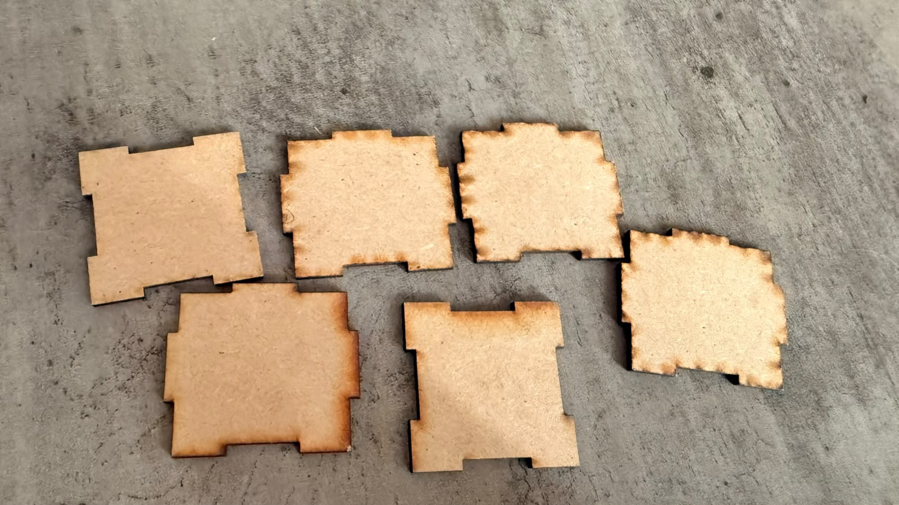
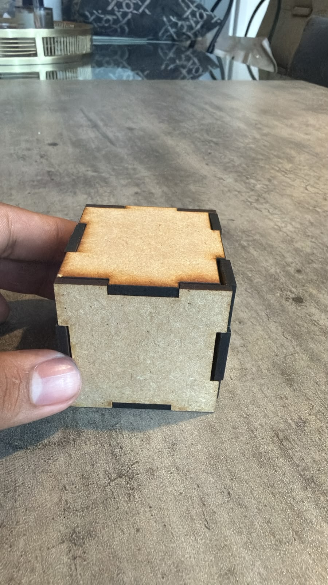

# Semana 3: Diseño de un cubo de PPF

Durante esta semana diseñamos y fabricamos una caja cúbica de **50 × 50 mm** con MDF de **3 mm** de grosor. Modelamos las piezas en 2D, las preparamos para corte láser y armamos el cubo con las piezas obtenidas.

## Diseño de las piezas

El diseño se compone de **cuatro lados** y **dos tapas**. Las pestañas y las muescas permiten unir las piezas. Se consideró una tolerancia de **0.2 mm** para que las uniones encajaran después del corte.

La guía de la actividad describe el uso de MDF de 3 mm y señala que las medidas de pestañas y muescas deben ajustarse para compensar el margen de corte de la máquina.

### Tapa (2 piezas)

### Lados (4 piezas)

## Diseño y preparación del corte

El diseño de las piezas se trabajó en un programa de dibujo y se cargó en la interfaz de la cortadora láser para preparar su posición de corte sobre el material.

La presentación de la actividad identifica la máquina como una **Glowforge Pro**. El manual indica revisar el archivo y el material antes del corte, mantener cerrada la tapa mientras la máquina trabaja y usar la ventilación del laboratorio.

## Piezas cortadas y armado

Después del corte láser, quedaron seis piezas de MDF: cuatro lados y dos tapas. El manual recomienda unirlas a presión, sin pegamento.

## Resultado final

## Material de referencia

- Presentación de la actividad: *Corte Laser*.
- Manual para la cortadora láser, de Alejandro Arellano Cacho.
