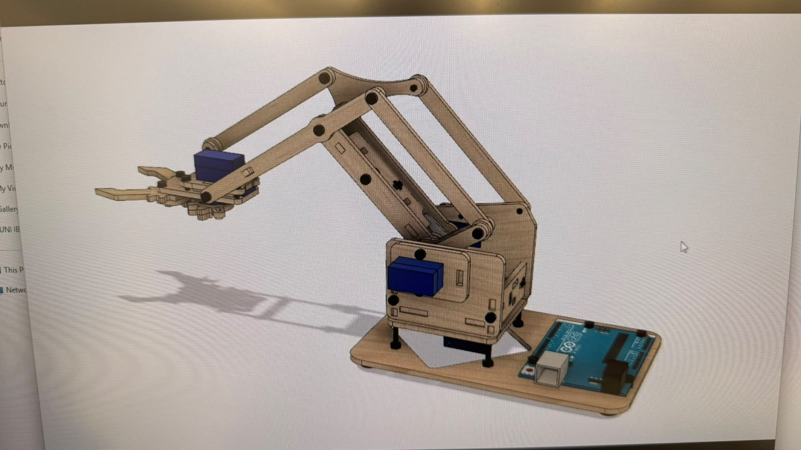
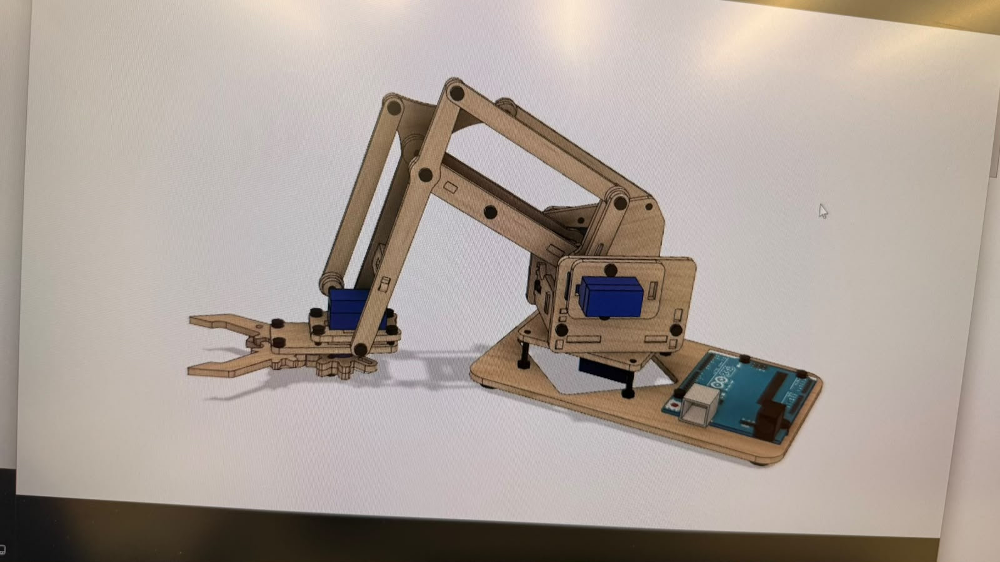
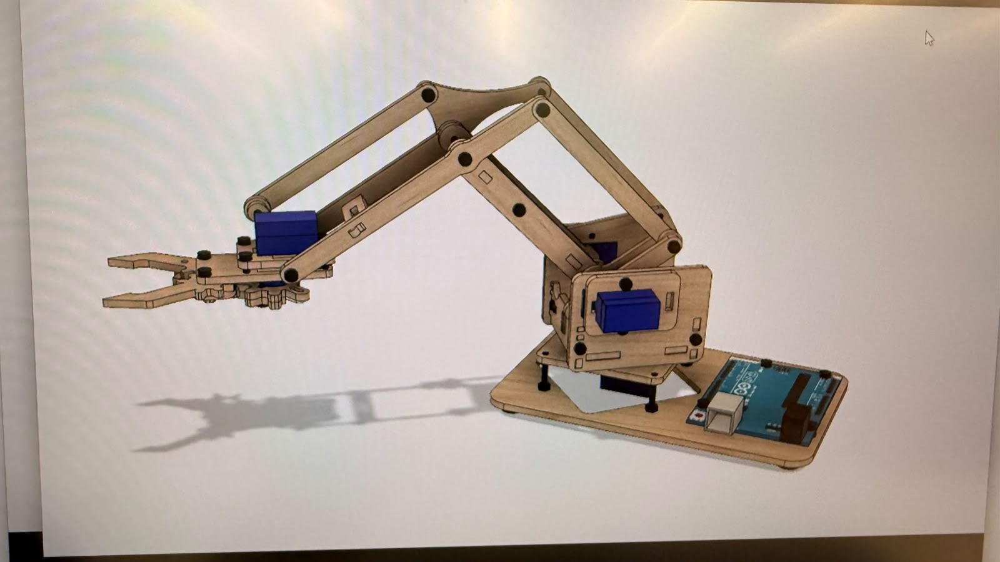
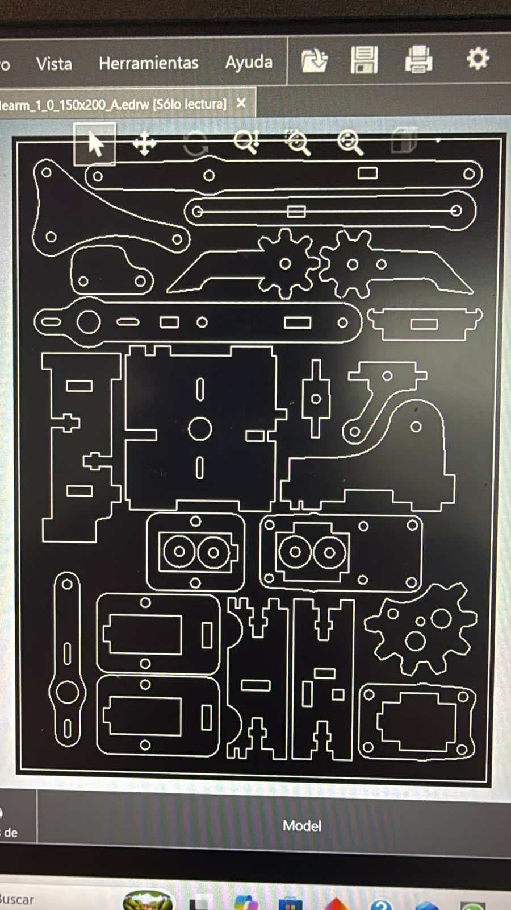
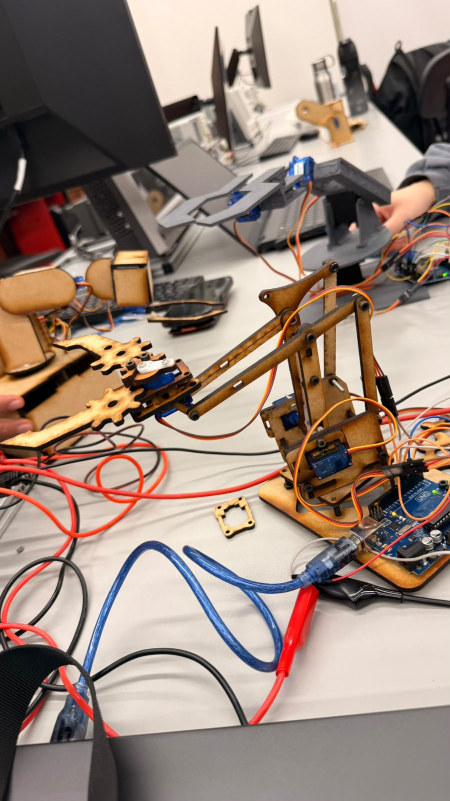

# Semana 4: Diseño del brazo robot

En este proyecto de medio semestre, realizado en pareja, diseñamos un brazo robot de **tres grados de libertad y una pinza**. El diseño se preparó para fabricar la estructura con corte láser en MDF de **3 mm**. Para el proyecto se utilizaron cuatro servomotores SG90, dentro del rango de cuatro a seis motores indicado por el profesor.

## Requisitos del proyecto

- Estructura fabricada en MDF de 3 mm mediante corte láser.
- Brazo con tres grados de libertad y una pinza.
- Cuatro servomotores SG90, controlados con Arduino y cuatro potenciómetros.
- Largo menor a 30 cm; el profesor recomendó aproximadamente 20 cm.
- Pinza capaz de sujetar una pelota de 6 cm de diámetro.
- Planos con cotas y dimensiones de las piezas, hechos en SolidWorks u otro programa CAD.

## Diseño de las piezas

Modelamos las piezas del brazo y las acomodamos en el programa de diseño para prepararlas para el corte. El diseño muestra la base, los eslabones, los soportes de los servos y las piezas de la pinza.

## Vistas del diseño

## Corte láser y brazo ensamblado

La primera imagen muestra el acomodo de las piezas para el corte láser. La segunda muestra el brazo robot ensamblado con sus servomotores y Arduino.

## Fabricación

1. Dibujamos las piezas con sus orificios y uniones.
2. Verificamos que las medidas fueran adecuadas para MDF de 3 mm y que el brazo respetara el tamaño solicitado.
3. Acomodamos las piezas en el área de corte láser.
4. Cortamos las piezas en MDF y revisamos que los orificios y ensambles quedaran libres de residuos.

## Evaluación solicitada

Para obtener 9, la pinza debía tomar una pelota y sostenerla durante 5 segundos usando los potenciómetros, con video de evidencia. Para obtener 10, tres equipos debían pasarse la pelota sin dejarla caer y sostenerla 5 segundos en cada robot. Estos puntos son los criterios del proyecto; el resultado de nuestras pruebas se documenta en la Semana 5.
